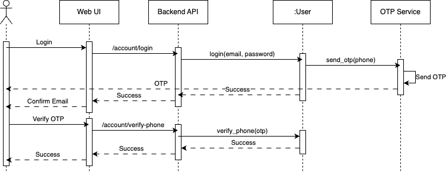

# Sprint 1:

## User Stories:
### [1. Registering for the XLP Platform](https://github.com/orgs/PSU-Loyalty-Exchange-Point-Project/projects/5/views/2)

> As a frequent customer of various brands and businesses, I want to register for a Loyalty Exchange Point platform, so that I can conveniently manage and exchange my loyalty points across different loyalty programs.

**Acceptance Criteria:**
 
- When I visit the Loyalty Exchange Point platform's website, I should see a clearly labeled "Register" or "Sign Up" button on the homepage.
- User Information: When I click on the "Register" button, I should be presented with a registration form that includes fields for my:
  - Full Name
  - Email Address
  - Password
  - Phone Number
  - Date of Birth (optional)
- The registration form should include validation checks to ensure that I enter a valid email address, a strong password, and any other required fields.
- Users are required to set up two-factor authentication (2FA) during account creation.
- I should have the option to view the platform's terms and conditions and privacy policy. There should be a checkbox for me to indicate that I have read and agreed to these documents before I can proceed with registration.
- After I successfully fill out the registration form and submit it, I should receive a confirmation email at the provided email address. This email should contain a link to verify my email address and complete the > registration process.
- Clicking the verification link in the email should take me to the platform's website and confirm that my email address is valid. Once verified, I should be directed to a confirmation page on the platform.
- The platform should implement strong security measures to protect my personal information and loyalty program account data. This includes encryption of data and hash password storage.
- Upon successful registration, I should receive an on-screen confirmation message indicating that my registration is complete and that I can start using the Loyalty Exchange Point platform.

---

### [2. Logging in to the XLP Platform](https://github.com/orgs/PSU-Loyalty-Exchange-Point-Project/projects/6/views/2)

> As a registered user of the XLP (Loyalty Exchange Point) platform, I want to be able to log in to my account securely, So that I can access my profile, manage my loyalty points, and perform transactions within the platform.

**Acceptance Criteria:**
 
- When I visit the XLP platform's website, I should see a clearly labeled "Log In" or "Sign In" button on the homepage.
- When I click on the "Log In" button, I should be presented with a login form that includes fields for:
  - With Email
    - Email Address
    - Password
  - With Phone Number
    - Phone Number
    - OTP
-  The login form should have a "Remember Me" checkbox that allows me to stay logged in on the device, so I don't have to re-enter my credentials each time I visit the platform.
- The login form should include validation checks to ensure that I enter a valid email address or username and a correct password.
- If I forget my password, there should be a "Forgot Password" link on the login page that allows me to reset my password. This should involve sending a password reset link to my registered email address or phone number.
- The platform should implement strong security measures for the login process, including protection against brute-force attacks and secure password handling.
- After successfully logging in, I should be directed to my user dashboard, where I can access and manage my loyalty points, view transaction history, and utilize the platform's features.
- There should be a "Log Out" option available within the platform to securely log me out of my account. After logging out, I should not be able to access my account without re-entering my credentials.
- To ensure security, my session should automatically log out after a period of inactivity. I should receive a warning before the session times out.

---

### [3. Securely Managing Loyalty Tokens](https://github.com/orgs/PSU-Loyalty-Exchange-Point-Project/projects/3/views/1)

> As an end user, I want to ensure that my loyalty tokens are protected from unauthorized access or theft, so I can have confidence in using the platform to manage my loyalty points.

**Acceptance Criteria:**
 
- Users are required to set up two-factor authentication (2FA) during account creation.
- The platform uses robust encryption methods to secure user accounts and loyalty point transactions.
- Users can remotely log out from devices and initiate account recovery procedures if they suspect unauthorized access.
- Ensure security, user session should automatically log out after a period of inactivity. I should receive a warning before the session times out.

---

